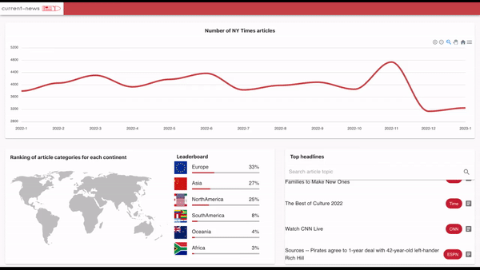

# current-news

This repository contains code for backend and frontend for the website I made to analyze current world news. It provides the number of NY Times articles for each month, top headlines, top categories for each continent.

  

## Usage

### How to run locally

1. Get the api key from https://newsdata.io/, place it in the backend/configs/config-categories.yml
2. Get the api key from https://newsapi.org/, place it in the backend/configs/config-headlines.yml
3. Get the api key from developers.nytimes.com, place it in the backend/configs/config-archive.yml
4. Run docker-compose. 
    * If you want to run db without a password: `docker-compose up -d`
    * If you want to use password for your db:
`REDIS_PASSWORD=<redis password> docker-compose up -d`

### How to run on a server

1. Do all the steps 1-3 from the above.
2. Run redis stack from the redis cloud. Copy adress to config-backend.
3. Run Dockerfile for backend on a server. `docker build -t backend . && REDIS_PASSWORD=<redis password> docker run backend`.
4. Change the backend address for the adress of your backend server. Run frontend: `docker build -t frontend -f Dockerfile.prod . && docker run frontend` 
